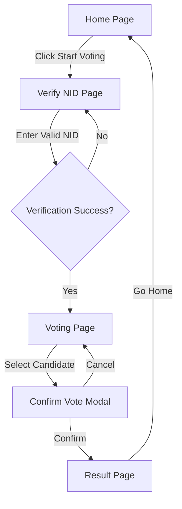
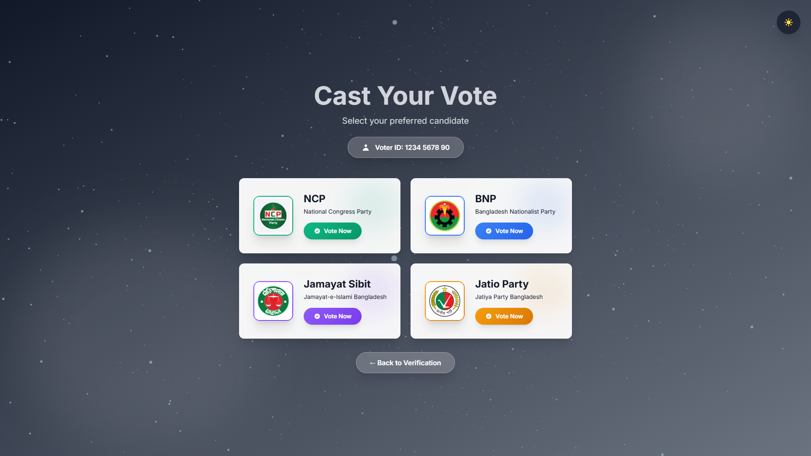

# E-voting App

A secure and modern electronic voting application built with **React**, **Vite**, and **Tailwind CSS**. This application features a seamless user experience with NID verification, candidate selection, and real-time result visualization.

## Technologies Used
- React.js + Vite
- Tailwind CSS + DaisyUI
- Framer Motion (Animations)
- Three.js / React Three Fiber (3D Backgrounds)
- Puppeteer (for documentation screenshots)

## Application Flow



## Screenshots

### Home Page


### Verify NID Page


### Voting Page


### Result Page


## Getting Started

1. **Install Dependencies**
   ```bash
   npm install
   ```

2. **Run Development Server**
   ```bash
   npm run dev
   ```

3. **Build for Production**
   ```bash
   npm run build
   ```
